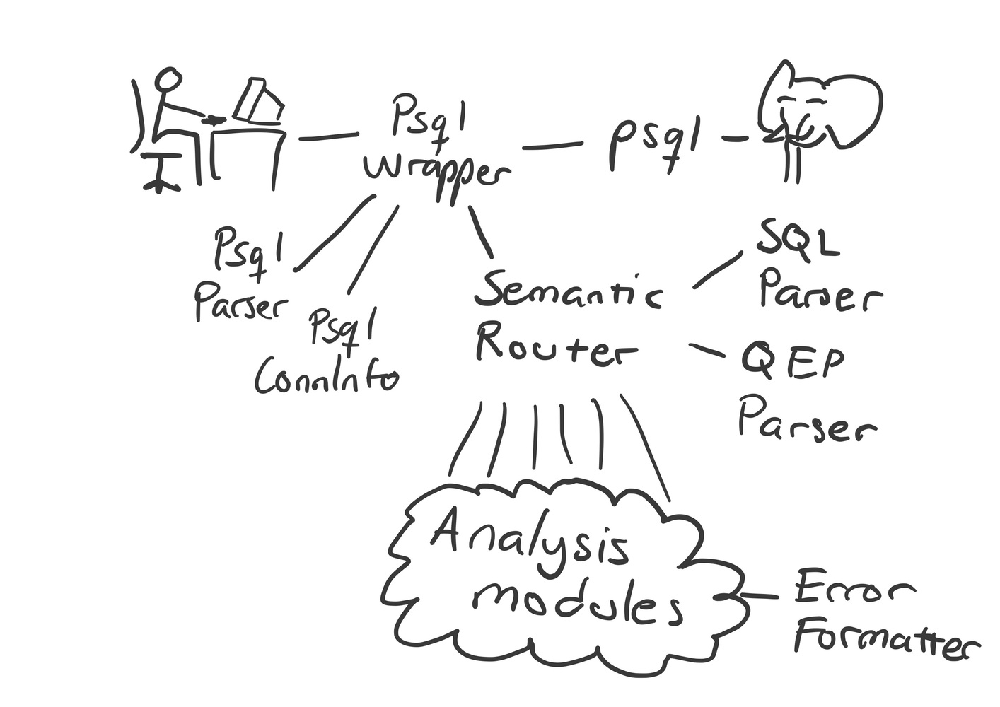

# Architecture

## Backend

### ErrorFormatter
Unified error formatting.
Each Checker class must use this to format their warning messages.

### PsqlConnInfo

`PsqlConnInfo` fetches PostgresSQL connection info by running a `psql` command with given arguments (usually same arguments as with what the main `psql` process was called with).

### QEPParser

See API docs.

### SemanticRouter

Runs SQLParser, QEPParser and semantic error analysis modules (as configured) against given SQL query string.

### SQLParser

Transforms sql string into a syntax tree.
Also provides some utilities like finding all tables in a sql statement.

### Analysis modules

#### CmpDomainChecker

Does analysis for suspicous comparisons between different domains.
e.g., comparing columns off type VARCHAR(20) and VARCHAR(50)
Returns a warning message if something was found, otherwise None.

#### EqWildcardChecker

Returns warning message if the sql has equals operation to a string with
wild card character (the '%' character), otherwise None.

#### ImpliedExpressionChecker

Returns warning message if implied expression is detected, otherwise None.

#### InconsistentExpressionChecker

Inconsistent expression is some expression that is never true.
For example: x = 10 AND x = 20

This checker only finds a small subset of such expression, where postgresql
itself detects the inconsistent expression in its query optimizer and
exposes that information via its query execution plan.

#### StrangeHavingChecker

Returns warning message if there exists HAVING without a GROUP BY, otherwise None.

#### SubqueryOrderByChecker

Returns warning message if there exists ORDER BY in a subquery,
otherwise None.

This check gives misses some situations with redundant ORDER BY but
should never give false positives, only false negatives.

#### SubquerySelectChecker

Returns warning message if there no column SELECTed in a subquery is
not used in that subquery of its own columns, otherwise returns None.

#### SumDistinctChecker

Returns warning message if the sql has SUM/AVG(DISTINCT ...), otherwise None

### Program configuration

The configuration files are read in order from: /etc/pg4n.conf then from $XDG\_CONFIG\_HOME/pg4n.conf, or if $XDG\_CONFIG\_HOME is not set, from
$HOME/.config/pg4n.conf, and lastly from $PWD/pg4n.conf, with each new value
introduced in latter files overriding the previous value.

Options in the configuration file are written like: "option\_name value" where value may be: true, 1, yes, false, 0, no

By default all warnings are enabled. Warnings can be disabled by warning type (which can be found from every warning message's end) e.g.

`CmpDomains false`

#### ConfigParser

Parses a configuration file.

#### ConfigReader

Reads all configuration files and combines their option output into a `ConfigValues` class.

#### ConfigValues

Contains option values specied in the configuration files.

## Frontend

Frontend handles user's psql session completely transparently via `PsqlWrapper`, although also injecting insightful messages regarding user's semantic errors into the terminal output stream. It parses user's SQL queries via `PsqlParser` for consumption in the backend.

### PsqlParser

`PsqlParser` uses `pyparsing` parser combinator library to provide parsing functions for
- checking for non-obvious Return presses (`output_has_magical_return`)
- checking if given string has a new prompt (e.g `=> `) (`output_has_new_prompt`)
- parsing a new prompt and everything that precedes it in a string, to allow easy message injection (`parse_new_prompt_and_rest`)
- parsing last SQL SELECT query in a string (`parse_last_stmt`)
- parsing `psql --version` output for version number (`parse_psql_version`)
- parsing syntax errors (`ERROR:` .. `^`) (`parse_syntax_error`)

Parsing rules common to more than 1 of these functions are listed in `PsqlParser` body, but otherwise rules are inside respective functions.

### PsqlWrapper

`PsqlWrapper` is responsible for spawning and intercepting the user-interfacing `psql` process. `pexpect` library allows both spawning and intercepting the terminal control stream. `pyte` library keeps track of current terminal display.

Overall working logic is handled by `_check_and_act_on_repl_output`, where it can be seen that queries are checked for every time user presses Return. If `PsqlParser` finds an SQL SELECT query, it's passed to `SemanticRouter` for further analysis, and any insightful message returned is saved for later. Once all query results have been printed, and a new prompt (e.g `..=> `) is going to be printed next per `latest_output` parameter, the wrapper injects the returned message. If results included `ERROR:` .. `^`, it is sent to syntax error analysis, and any returned message will be injected immediately.

`PsqlWrapper` also checks `psql` version info and checks it against `PsqlWrapper.supported_psql_versions`.
